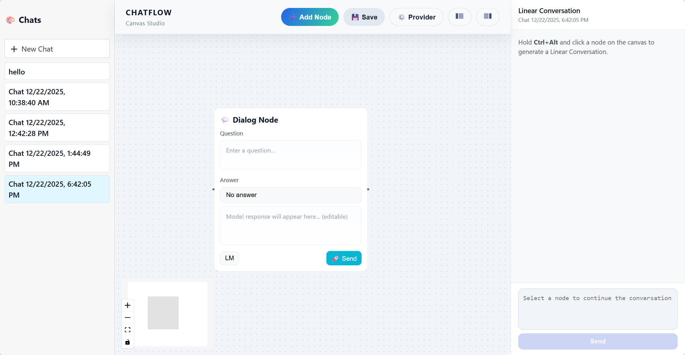
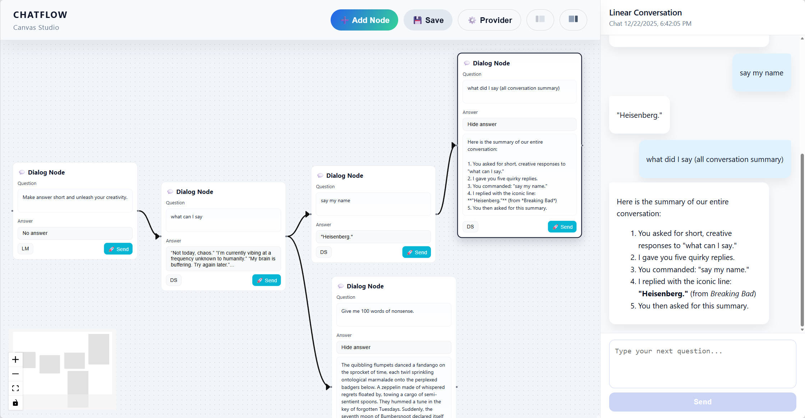

# ChatFlow

ChatFlow is a small experimental chat app for exploring **branching conversations** as a **minimal extension** of **linear chat**.
## 📸 Screenshots




## 🚀 Quick Start

### Requirements 
- Node.js 16+
- npm
### Installation

```bash
git clone https://github.com/CatheadOwl/ChatFlow.git
cd ChatFlow
npm install
npm run dev
```

Open the local Vite URL shown in the terminal.

### Set a provider
Once you’re in the canvas, don’t forget to set up a provider with your API key (OpenAI API-compatible).
> Note: Avoid exposing real API keys in the frontend. Prefer a **backend proxy** and store the real key on the server to reduce leakage risk.

## 📘 Overview 

**ChatFlow** is a chat application that supports **branching conversations**.

The goal is to explore branching chat as a **minimal extension** of the classic linear chat model, without turning it into a complex workflow engine.

## ✨ Key Features

### 🌿 Branching Conversations
- Every message node can branch into multiple future responses
- Each branch evolves independently without interfering with others
### 💬 Context Management
- 🔄 **Automatic upstream context tracing**  
  Automatically includes all upstream nodes as context (full history)
- ✂️ **Manual context pruning**

  Delete or modify intermediate nodes to:
  - Remove unwanted memory
  - Fix unsatisfactory Q&A
  - Create cleaner branches
### 🧠 Philosophy

> Splitting problems solves most problems.

- **Long context** spreads **attention** too thin
- Different lines of thought should not pollute each other
- Explicit branching keeps **reasoning** clean
## 🎯 Typical Use Cases

### 🤖 LLM Multi-Answer Exploration

Modern LLMs often provide **2–3 different suggestions** in a single response.

These suggestions may:
- Lead to completely different directions
- Compete for context attention

ChatFlow allows you to:
- Split each suggestion into its own branch
- Explore them independently
- Avoid cross-branch interference

## 🧩 What ChatFlow Is / Is Not

- ✅**ChatFlow** Is Just A small, minimal experimental exploration of **branching** in ChatGPT-style conversations
- ❌**ChatFlow** Is Not A tool like LangFlow / Dify

## 📄 License

MIT License

